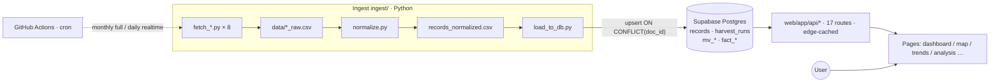
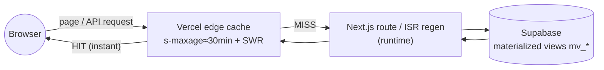
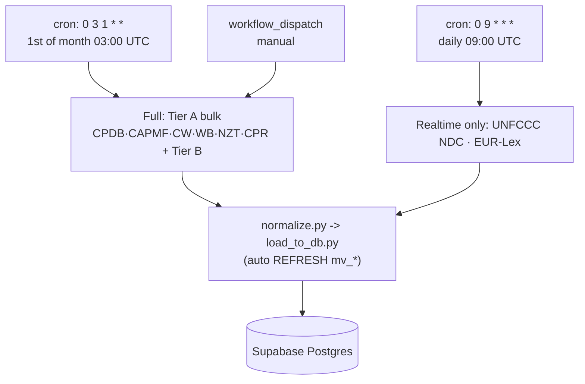
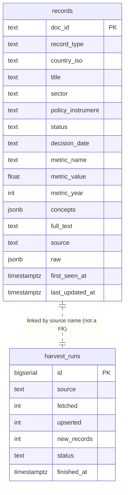

# Climate Policy Monitor — Handbook & Operations Manual

> This is the project's master guide + ops manual. After reading it you should be able to independently: **collect data, initialize the database, develop locally, deploy, troubleshoot, and add a new data source.**
>
> 中文版:[`HANDBOOK.md`](./HANDBOOK.md) · PDF: `HANDBOOK.pdf` / `HANDBOOK.en.pdf` (generated by `tools/build-pdf.mjs`)
>
> Companion docs (this handbook is the entry point):
> - [`README.md`](./README.md) — quick start
> - [`PLAN.md`](./PLAN.md) — product direction & visualization design
> - [`FUSION.md`](./FUSION.md) — multi-source fusion (crosswalks + fact views)
> - [`SETUP.md`](./SETUP.md) — step-by-step Supabase / Vercel setup
> - [`CLAUDE.md`](./CLAUDE.md) — code guide for AI collaborators
> - [`docs/data_dictionary.csv`](./docs/data_dictionary.csv) — field → source map

---

## Contents

1. [What this is](#1-what-this-is)
2. [Architecture & data flow](#2-architecture--data-flow)
3. [Repository layout](#3-repository-layout)
4. [Tech stack & services to set up](#4-tech-stack--services-to-set-up)
5. [Environment variables](#5-environment-variables)
6. [Data sources](#6-data-sources)
7. [How to collect data (pipeline + commands)](#7-how-to-collect-data-pipeline--commands)
8. [Database: init & schema](#8-database-init--schema)
9. [Web app & API reference](#9-web-app--api-reference)
10. [Deployment](#10-deployment)
11. [Day-to-day operations](#11-day-to-day-operations)
12. [Troubleshooting](#12-troubleshooting)
13. [Security & ownership](#13-security--ownership)
14. [Command cheat sheet](#14-command-cheat-sheet)

---

## 1. What this is

The **Climate Policy Monitor** unifies global climate **laws, policies, NDCs, net-zero pledges and carbon pricing** from **8 authoritative sources** into one harvested, normalized, visualized and cross-analyzable platform. ~**670k records**.

It is the third member of the **Program on Climate and Science Communication** family of monitors:
- News monitor `monitor.newsfindsme.com`
- Paper monitor `pmonitor.newsfindsme.com`
- **Policy monitor `cpmonitor.newsfindsme.com` (this project)**
- Research portal `research.newsfindsme.com`

Live: **https://cpmonitor.newsfindsme.com** (Vercel; `…vercel.app` is a backup alias of the same deployment).

---

## 2. Architecture & data flow

Three layers sharing one Postgres table:



- **Ingest writes only to Postgres**; the intermediate CSVs are regenerable scratch (gitignored, never committed).
- **Web reads only Postgres**, never the CSVs.
- **GitHub Actions** runs the pipeline on a cron (see §7).

**Key design**
- **`doc_id` is the source-prefixed primary key** (`cpdb:123`, `cpr:…`, `ndc:CHN:…`); `load_to_db.py` upserts with `ON CONFLICT (doc_id) DO UPDATE`, so re-ingests are idempotent.
- **The `raw` JSONB column preserves every original field** per record (omitted for the high-volume OECD / ndc_content rows to save space).
- **`record_type` discriminates heterogeneous rows**: `law | policy | ndc | lts | net_zero | carbon_price | carbon_crediting | cooperative_approach | stringency_score | litigation`.

**Request path (why China is slow, how caching helps):**



> The slow hop from China is **Browser → Vercel edge** (no mainland PoP + GFW + proxy), **not** the server/DB behind it. See §12.

---

## 3. Repository layout

```
climate-policy-platform/
├─ ingest/                  # Ingest layer (Python 3.11/3.12)
│  ├─ common.py             # Shared: COLUMNS, DB connection, CSV reads, harvest manifest
│  ├─ fetch_cpdb.py         # one fetcher per source (8 total)
│  ├─ fetch_oecd_capmf.py
│  ├─ fetch_climatewatch.py
│  ├─ fetch_worldbank_carbon.py
│  ├─ fetch_netzero.py
│  ├─ fetch_unfccc_ndc.py
│  ├─ fetch_eurlex.py
│  ├─ fetch_cpr.py
│  ├─ normalize.py          # all *_raw.csv -> records_normalized.csv
│  ├─ load_to_db.py         # upsert + write harvest_runs + refresh matviews
│  ├─ run_all.ps1           # one-shot local: fetch -> normalize -> load
│  ├─ requirements.txt
│  └─ .env.example          # copy to .env, fill DATABASE_URL (.env not committed)
├─ db/
│  ├─ schema.sql            # records / harvest_runs / base views / indexes (required)
│  ├─ perf.sql              # dashboard matviews + idx_rec_updated (required)
│  ├─ fusion.sql            # crosswalks + fact views (advanced analytics, recommended)
│  └─ crosswalks/*.csv      # taxonomy maps (sector/instrument/status/legal_force)
├─ web/                     # Next.js 14 App Router (Vercel)
│  ├─ app/                  # pages + app/api/* routes
│  ├─ components/           # charts, map, tables, Shell, etc.
│  ├─ lib/                  # db.js / i18n.js / iso.js / cache.js / csv.js / crossdb.js
│  ├─ public/               # countries-110m.json (world map, bundled — no CDN)
│  └─ package.json
├─ docs/data_dictionary.csv # field -> source map
├─ tools/build-pdf.mjs      # generate HANDBOOK.pdf / HANDBOOK.en.pdf (Chrome headless)
├─ .github/workflows/ingest.yml  # scheduled ingest CI
├─ HANDBOOK.md / HANDBOOK.en.md (this) / README.md / PLAN.md / FUSION.md / SETUP.md / CLAUDE.md
└─ .gitignore               # ignores .env / node_modules / data intermediates
```

> ⚠️ **The git root is the parent `Downloads/`, not this folder.** `git status` is flooded with unrelated files. Always `git add` **explicit paths** — never `git add -A` / `git add .`.

---

## 4. Tech stack & services to set up

| Layer | Tech | Notes |
|---|---|---|
| Ingest | Python **3.11 / 3.12** | 3.14 may lack wheels for pandas/psycopg2/pyarrow — **don't use 3.14** |
| Database | **Supabase** Postgres (free tier) | 2GB disk, ~0.5GB used |
| Web | **Next.js 14** + React 18 + Recharts + react-simple-maps | App Router |
| DB driver (web) | **postgres.js** (`postgres` pkg) | NOT `@vercel/postgres` (Neon-only, can't reach Supabase) |
| Hosting | **Vercel** | auto-deploys from GitHub `main` |
| Scheduled ingest | **GitHub Actions** | cron; a China proxy often blocks raw Postgres TCP locally, so load via Actions |

**Accounts needed:** GitHub (repo + Actions) · Supabase (database) · Vercel (hosting). Setup walkthrough in [`SETUP.md`](./SETUP.md).

---

## 5. Environment variables

| Variable | Used by | Set where | Purpose / value |
|---|---|---|---|
| `DATABASE_URL` | ingest (`load_to_db.py`, `common.py`) | GitHub Actions Secret + local `ingest/.env` | Supabase **Session Pooler**: `postgres://postgres.<ref>:<pwd>@aws-0-<region>.pooler.supabase.com:**5432**/postgres` |
| `POSTGRES_URL` | web (`web/lib/db.js`) | Vercel env var | Supabase **Transaction Pooler** (port **6543**); postgres.js uses `prepare:false` |
| `PAPERS_DATABASE_URL` | web cross-monitor (`crossdb.js`) | Vercel (optional) | papers DB; without it the cross page's papers line is missing |
| `NEWS_DATABASE_URL` | web cross-monitor (`crossdb.js`) | Vercel (optional) | news DB; without it the news line is missing |
| `WB_CARBON_URL` | ingest (World Bank) | Actions Secret (optional) | override the WB carbon .xlsx URL; auto-resolved from the site if unset |
| `CPDB_URL` | ingest (optional) | local/Actions | override the CPDB CSV URL |
| `CAPMF_START` / `CAPMF_END` | ingest (OECD, optional) | local/Actions | CAPMF year range, default 1990–2023 |
| `CW_DATASETS` / `CW_MAX_PAGES` | ingest (Climate Watch, optional) | local/Actions | dataset list / page cap |
| `CPR_MAX_DOCS` / `CPR_MAX_SHARDS` / `CPR_SHARD_START` | ingest (CPR, optional) | local/Actions | caps; default = all |
| `NETZERO_URL` / `NDCS_URL` | ingest (optional) | local/Actions | override default mirror URLs |
| `EURLEX_SINCE` / `EURLEX_PAGE` / `EURLEX_MAX` | ingest (EUR-Lex, optional) | local/Actions | start date / page / cap |

> **Two different DB var names**: ingest uses `DATABASE_URL`, web uses `POSTGRES_URL`. **Don't mix them.**
> **Use the Pooler, not Direct** (`db.<ref>.supabase.co` is IPv6-only on the free tier; fails on IPv4/proxied networks). Session Pooler (5432) for ingest, Transaction Pooler (6543) for web.
> In Vercel, make sure `POSTGRES_URL` is **also available at Build time**, or ISR pages can't reach the DB during build (see §12 build timeout).

---

## 6. Data sources

Each source contributes a different slice of the unified `records` row. Below are the **actual default URLs, env vars, output files and record_types from the code.**

| # | Source (org) | Provides | Default URL | Output CSV | record_type | License |
|---|---|---|---|---|---|---|
| 1 | **CPDB** (NewClimate, via Zenodo) | Structured policy: sector/instrument/status/decision-year + stringency | `zenodo.org/records/15432946/files/ClimatePolicyDatabase_v2024.csv` | `cpdb_raw.csv` | `policy` | CC-BY-4.0 |
| 2 | **OECD CAPMF** | Stringency 0–10 + policy counts, ~50 countries, 4-level policy hierarchy | SDMX REST `sdmx.oecd.org/public/rest/data/OECD.ENV.EPI,DSD_CAPMF@DF_CAPMF,1.0/...` | `oecd_capmf_raw.csv` | `stringency_score` | OECD |
| 3 | **Climate Watch** (WRI) | NDC / LTS / net-zero content (per-country key–values) | `climatewatchdata.org/api/v1/data` | `climatewatch_raw.csv` | `ndc`/`lts`/`net_zero` | CC-BY-4.0 |
| 4 | **World Bank** Carbon Pricing | Carbon prices + crediting mechanisms + cooperative approaches (3 sheets) | resolved from `carbonpricingdashboard.worldbank.org/about` (.xlsx) | `worldbank_carbon_raw.csv` | `carbon_price`/`carbon_crediting`/`cooperative_approach` | CC-BY-4.0 |
| 5 | **Net Zero Tracker** (via OWID mirror) | Net-zero target year + legal force | `ourworldindata.org/grapher/net-zero-targets.csv` | `netzero_raw.csv` | `net_zero` | CC-BY |
| 6 | **UNFCCC NDC Registry** (via openclimatedata mirror) | NDC registry | `raw.githubusercontent.com/openclimatedata/ndcs/main/data/ndcs.csv` | `unfccc_ndcs_raw.csv` | `ndc` | public domain |
| 7 | **EUR-Lex** (CELLAR SPARQL) | EU climate-related legislation (EuroVoc concept 5482) | `publications.europa.eu/webapi/rdf/sparql` | `eurlex_raw.csv` | `law` (country `EUU`) | EU reuse |
| 8 | **CPR / CCLW** (Climate Policy Radar, via HuggingFace) | Law/policy catalog metadata + KG concepts (**catalog only, no full text**) | HF dataset `ClimatePolicyRadar/all-document-text-data` (48 shards) | `cpr_raw.csv` | `law`/`policy`/`litigation` | CC-BY-4.0 |

**Important caveats** (also on the site's "Docs" page):
- **CAPMF stringency is a country-level average, not per-policy** — `normalize.py` averages `OBS_VALUE` per country and maps it onto all of that country's rows.
- **CPR is catalog metadata only, no full text** (source links kept for traceability).
- **Full-text search uses Postgres `simple` config (no stemming)** for multilingual (CN+EN) content.
- Each fetcher is **allowed to fail/skip** (CI uses `|| echo skipped`); a missing source doesn't block the pipeline.

---

## 7. How to collect data (pipeline + commands)

### 7.1 Pipeline order (strict)
```
fetch_*.py   ->  data/*_raw.csv
normalize.py ->  data/records_normalized.csv   (consumes all *_raw.csv)
load_to_db.py -> Postgres                       (consumes records_normalized.csv)
```
Scripts resolve paths via `__file__`, so they run from any cwd; always run `python ingest/<script>.py` (so `import common` works).

### 7.2 One-shot local full run (Windows PowerShell)
```powershell
# 1) deps (use a 3.11/3.12 interpreter)
pip install -r ingest/requirements.txt
pip install datasets        # needed for CPR streaming (optional)

# 2) connection string: copy and fill the Session Pooler string
copy ingest\.env.example ingest\.env
#   edit ingest\.env: DATABASE_URL=postgres://postgres.<ref>:<pwd>@aws-0-<region>.pooler.supabase.com:5432/postgres

# 3) full run (fetch all -> normalize -> load)
powershell -ExecutionPolicy Bypass -File .\ingest\run_all.ps1
```

### 7.3 Run a single step
```powershell
python ingest/fetch_cpdb.py          # re-fetch only CPDB -> data/cpdb_raw.csv
python ingest/fetch_oecd_capmf.py
python ingest/normalize.py           # merge all *_raw.csv
python ingest/load_to_db.py          # upsert (needs DATABASE_URL)
```

> 🇨🇳 **Direct Postgres from a China machine often fails** (Clash/V2Ray fake-ip 198.18.x.x blocks raw TCP). Workaround: **load via GitHub Actions**; use the local machine only for fetch/normalize debugging, or load from a clean network.

### 7.4 Scheduled ingest (GitHub Actions, recommended)
Config: [`.github/workflows/ingest.yml`](./.github/workflows/ingest.yml)



- **Triggers**:
  - `cron: '0 3 1 * *'` — **1st of month, 03:00 UTC**, runs the **full** set (Tier A bulk + Tier B).
  - `cron: '0 9 * * *'` — **daily 09:00 UTC**, runs **realtime sources only** (UNFCCC NDC, EUR-Lex).
  - `workflow_dispatch` — manual full run from the GitHub **Actions → Run workflow** UI.
- **Required Secrets** (GitHub → Settings → Secrets and variables → Actions):
  - `DATABASE_URL` (**required**, Session Pooler string)
  - `WB_CARBON_URL` (optional)
- **Manual trigger**: repo → Actions → "Ingest Climate Policy Data" → Run workflow → pick `main` → Run.
- Each fetch step may fail (`|| echo skipped`); `normalize` and `load` may not.

> Ingest does **not** commit CSVs back to the repo (the normalized CSV with raw JSON is large). Postgres is the store of record; the `harvest_runs` table is the audit trail (visible on the site's "Data" page).

---

## 8. Database: init & schema

### 8.1 First-time init (run in order in the Supabase SQL Editor)
1. **`db/schema.sql`** — `records`, `harvest_runs`, base views, indexes, FTS index. **Required.**
2. **`db/perf.sql`** — dashboard matviews (`mv_kpis` / `mv_map_metrics` / `mv_adoption`) + `idx_rec_updated`. **Required** (else the dashboard is slow/empty).
3. **`db/fusion.sql`** — crosswalk tables + `fact_*` / `v_*` fusion views for diffusion, LEV2, breadth×depth, etc. **Recommended** (see [`FUSION.md`](./FUSION.md)).
   - The `db/crosswalks/*.csv` (sector/instrument/status/legal_force) are taxonomy maps; import per `FUSION.md`.

> All scripts are **safe to re-run** (`IF NOT EXISTS` / `CREATE OR REPLACE` / `DROP ... IF EXISTS`).

### 8.2 Core schema



`doc_id` is the PK; `record_type` discriminates; `country_iso` (ISO-3) is the fusion key; `metric_name`/`metric_value`/`metric_year` are a generic metric slot; `raw` JSONB holds the full original row; `first_seen_at`/`last_updated_at` are DB-managed.

> **Four places define the same columns** (change one, usually change all): `db/schema.sql` / `ingest/common.py` `COLUMNS` / `ingest/load_to_db.py` `INSERT_COLS` / `docs/data_dictionary.csv`. `web/lib/db.js` SELECTs a subset — update its queries when renaming a column.

### 8.3 Views
- **Base views** (schema.sql): `agg_country_record`, `agg_adoption_by_year`, `agg_latest_metric`.
- **Materialized views** (perf.sql, dashboard; `load_to_db.py` REFRESHes them after each ingest): `mv_kpis`, `mv_map_metrics`, `mv_adoption`.
- **Fusion views** (fusion.sql): `fact_policy`, `fact_metric`, `fact_commitment`, `v_records_canon`, `v_diffusion_curve`, etc.

---

## 9. Web app & API reference

### 9.1 Key lib files (`web/lib/`)
- **`db.js`** — postgres.js client + all query functions; reads matviews (fast). Includes `withTimeout()` (bounds build-time ISR queries, see §12).
- **`crossdb.js`** — lazily connects to the papers/news DBs (`PAPERS_DATABASE_URL` / `NEWS_DATABASE_URL`) for the cross-monitor view.
- **`i18n.js`** — CN/EN dictionary + `useT()`; remembers language in `localStorage`.
- **`iso.js`** — `NUM2ISO` (map numeric code → ISO3), `cname()` (ISO3 → CN/EN name), `ALL` (for dropdowns). **Without it the map is blank** (the world map keys by numeric code, our data is ISO-3).
- **`cache.js`** — edge cache headers `CACHE` (s-maxage=1800 + SWR) / `CACHE_SHORT`.
- **`csv.js`** — export aggregated chart data to CSV (UTF-8 BOM).

### 9.2 API routes (`web/app/api/*`, all read-only, edge-cached)
| Route | Purpose | Params |
|---|---|---|
| `/api/dashboard` | Combined dashboard payload (KPIs+map+trend+feed), cached 30 min | — |
| `/api/stats` | KPIs + adoption (slim) | — |
| `/api/map` | Per-country metric (choropleth), reads `mv_map_metrics` | `metric=coverage\|stringency\|price\|netzero` |
| `/api/records` | Filtered policy list | `country/sector/status/recordType/limit` |
| `/api/whatsnew` | Newest records (by `first_seen_at`) | `limit` |
| `/api/harvest` | Latest harvest per source (transparency) | — |
| `/api/trends` | Adoption + stringency by year | — |
| `/api/composition` | Sector/instrument/type/status breakdown | — |
| `/api/compare` | Multi-country compare (sector heatmap + stringency + net-zero) | `c=DEU,CHN,USA` |
| `/api/country` | Country profile (KPIs, stringency trajectory, records) | `iso=CHN` |
| `/api/diffusion` | Cumulative adopter countries per instrument (S-curve) | — |
| `/api/lev2` | CAPMF LEV2 policy-area stringency heatmap | `c=DEU,CHN,…` |
| `/api/analysis` | breadth×depth + net-zero + promise×action + bivariate (combined) | — |
| `/api/cross` | Policy × papers × news by year (cross-monitor) | — |
| `/api/instrument-mix` | Instrument-family mix per country | `c=DEU,CHN,…` |
| `/api/search` | Full-text search + facet filters | `q` + `country/type/source` |
| `/api/search-facets` | Distinct types/sources for the search dropdowns (cached) | — |

### 9.3 Pages (`web/app/*`)
Dashboard `/` (ISR) · Map `/map` · Trends `/trends` (ISR) · Compare `/compare` · Composition `/composition` (ISR) · Analysis `/analysis` · Cross `/cross` · Live `/live` · Search `/search` · Insights `/insights` · Docs `/methodology` · About `/about` · Data `/data` · Country detail `/country/[iso]`.

### 9.4 Local development
```powershell
cd web
npm install
# local needs POSTGRES_URL (Transaction Pooler 6543); Session Pooler 5432 also works
$env:POSTGRES_URL="postgres://postgres.<ref>:<pwd>@aws-0-<region>.pooler.supabase.com:6543/postgres"
npm run dev      # http://localhost:3000
npm run build    # production build (same as Vercel)
```
> This repo has **no tests and no linter** — don't invent `npm test` / `pytest`.

---

## 10. Deployment

- **Vercel** auto-deploys from GitHub `main` (`web/` root; `vercel.json` sets `next build`).
- **Env vars** (Vercel → Settings → Environment Variables): `POSTGRES_URL` (required), `PAPERS_DATABASE_URL`/`NEWS_DATABASE_URL` (optional). **Make sure they apply to Build + Production.**
- **Custom domain**: `cpmonitor.newsfindsme.com` is CNAME'd to Vercel. Set it as the **Primary Domain** so `…vercel.app` **301-redirects** to it.
- **Release flow**: `git push` to `main` → Vercel builds & deploys. **`git add` explicit paths only** (see §3 warning).
- After pushing, watch the Vercel build log; a healthy build ends at `✓ Generating static pages (N/N)`.

---

## 11. Day-to-day operations

- **Update cadence**: bulk sources monthly (1st); realtime (UNFCCC/EUR-Lex) daily; web dashboard/trends/composition are ISR, regenerated server-side every 30 min. Need it now → run the Action manually.
- **Manual top-up**: GitHub → Actions → Run workflow (full); `load_to_db.py` refreshes the matviews at the end.
- **Add a new source** (steps):
  1. Write `ingest/fetch_newsrc.py` (model it on an existing fetcher; call `common.record_fetch()`; output `data/newsrc_raw.csv`).
  2. Add a `from_newsrc()` mapper in `ingest/normalize.py`, emit unified `record(...)`, add it to `SOURCES`; prefix `doc_id` with `newsrc:<id>`.
  3. Add a step in `.github/workflows/ingest.yml`: `python ingest/fetch_newsrc.py || echo skipped`.
  4. If you add columns, sync the "four places" in §8.2.
- **Change a taxonomy (sector/instrument/…)**: edit `db/crosswalks/*.csv` and re-run `db/fusion.sql` (see `FUSION.md`).
- **Renamed a column**: sync schema.sql / common.COLUMNS / load_to_db.INSERT_COLS / data_dictionary.csv, and any `web/lib/db.js` query that uses it.

---

## 12. Troubleshooting

> Symptom → cause → fix. Most issues are network / connection-string / matview.

**▶ Vercel build fails: `Static page generation for / is still timing out`**
- Cause: the dashboard/trends/composition pages are ISR and **query Supabase at build time**; if the build sandbox can't reach the DB, the query hangs past 60s.
- Fix: `web/lib/db.js` `withTimeout(…, 12s)` bounds the build-time fetch (falls back to empty; ISR + the client self-heal fill it at runtime). **Also ensure `POSTGRES_URL` is available at Build time in Vercel** so the build can bake real data.

**▶ Slow / intermittently unreachable from China**
- Cause: **Vercel has no mainland-China PoP**; requests cross the GFW + your proxy (fake-ip) to HK/Tokyo. Measured: even an 8KB page has 1.5–5s TTFB and ~half the requests fail — **it's the network, not the app** (the app already has full edge caching, code-splitting, ISR on key pages, and a 10KB dashboard payload).
- Fix: (1) try a HK/Japan proxy node or a direct connection to confirm; (2) the durable fix is hosting in **HK/Singapore VPS** or a **China CDN + ICP filing**. A custom domain (`cpmonitor…`) does **not** make it faster — it's just a CNAME to the same Vercel.

**▶ Local `load_to_db.py` connection fails** (`connection to server … 198.18.x.x failed` / `server closed the connection`)
- Cause: Clash/V2Ray fake-ip blocks raw Postgres TCP.
- Fix: load via **GitHub Actions**, or use a clean network; always use the **Session Pooler (5432)**, never Direct (IPv6-only).

**▶ Web shows no data but `/api/stats` works**
- Cause (historical): the world-map topojson failed to load from a (blocked) CDN → now **bundled** at `web/public/countries-110m.json`.
- Or: the map keys by **numeric country code** while data is **ISO-3** → fixed via `web/lib/iso.js` `NUM2ISO`.

**▶ Dashboard slow**
- Cause: early versions aggregated 673k rows per request; or the matviews weren't created.
- Fix: run `db/perf.sql` for the matviews; all `/api/*` are now edge-cached (`web/lib/cache.js`); dashboard/trends/composition are ISR.

**▶ `psycopg2.errors.CardinalityViolation: ON CONFLICT … cannot affect row a second time`**
- Cause: duplicate `doc_id` within one batch (UNFCCC multilingual, World Bank name collisions).
- Fix: `load_to_db.py` dedupes by `doc_id` dict; the UNFCCC `doc_id` includes Language; WB Cooperative includes Year. Keep `doc_id` unique in new fetchers.

**▶ CPDB `Error tokenizing data … Expected 1 fields`**
- Cause: the live export URL returns a Drupal anti-bot HTML page, not CSV.
- Fix: now uses the **Zenodo snapshot CSV** (`fetch_cpdb.py` default URL).

**▶ OECD CAPMF fetch fails / rate-limited**
- Cause: the SDMX API caps at ~**20 downloads/hour/IP**.
- Fix: don't re-run frequently; take a wide slice at once; failures skip (`|| echo skipped`) without blocking the pipeline.

**▶ `GBK` encoding error when printing Chinese (local console)**
- Fix: `sys.stdout.reconfigure(encoding='utf-8', errors='replace')`, or `chcp 65001` in PowerShell.

**▶ pip fails to install pandas/psycopg2/pyarrow**
- Cause: **Python 3.14** (no wheels).
- Fix: use **3.11 / 3.12**.

**▶ Papers/news lines missing on the cross page**
- Cause: `PAPERS_DATABASE_URL` / `NEWS_DATABASE_URL` not set on Vercel.
- Fix: set those connection strings in Vercel.

**▶ `@vercel/postgres` `invalid_connection_string`**
- Cause: `@vercel/postgres` is Neon-only and can't reach Supabase.
- Fix: already migrated to **postgres.js** (`prepare:false, ssl:'require'`).

---

## 13. Security & ownership

- **`.env` / `node_modules` / `data/*` are gitignored and uncommitted** (verified `ingest/.env` is untracked). The repo is **public**, so **never put any secret/connection string in code or commits** — keep connection strings only in GitHub Secrets and Vercel env vars.
- If `DATABASE_URL` ever leaks: **reset the database password** in Supabase and update the Secrets/env vars.
- **Data ownership**: copyright in each underlying dataset belongs to its provider (see §6 licenses and the site's About/Docs pages). The platform's code, design and derived visualizations belong to the Program on Climate and Science Communication. Derived aggregate views/charts may be used for **non-commercial research and teaching with attribution**.
- **Disclaimer**: research/education only; data is auto-harvested and normalized and may contain latency/gaps/mapping errors; provided "as is", not legal/investment/policy advice; defer to official primary sources.

---

## 14. Command cheat sheet

```powershell
# —— Ingest (local) ——
pip install -r ingest/requirements.txt; pip install datasets
copy ingest\.env.example ingest\.env          # fill DATABASE_URL (Session Pooler 5432)
powershell -ExecutionPolicy Bypass -File .\ingest\run_all.ps1   # full fetch->normalize->load
python ingest/normalize.py                     # re-normalize only
python ingest/load_to_db.py                    # re-load only

# —— Database (Supabase SQL Editor, in order) ——
#   db/schema.sql  ->  db/perf.sql  ->  db/fusion.sql
CREATE INDEX IF NOT EXISTS idx_rec_updated ON records (last_updated_at DESC NULLS LAST);  # in perf.sql

# —— Web ——
cd web; npm install
$env:POSTGRES_URL="…6543/postgres"; npm run dev   # local dev
npm run build                                       # production build (same as Vercel)

# —— Release ——
git add web ingest db docs HANDBOOK.md HANDBOOK.en.md tools .github   # explicit paths! never git add -A
git commit -m "…"; git push                          # push main -> Vercel auto-deploys

# —— Generate PDF (needs Node; uses local Chrome/Edge headless) ——
node tools/build-pdf.mjs                              # outputs HANDBOOK.pdf / HANDBOOK.en.pdf

# —— Scheduled ingest ——
# GitHub → Actions → "Ingest Climate Policy Data" → Run workflow (manual full run)
```

---

*Last updated: 2026-06. Keep this file in sync when the pipeline / sources / deployment change.*
