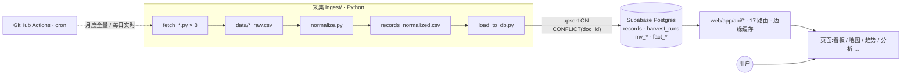
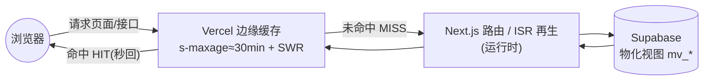
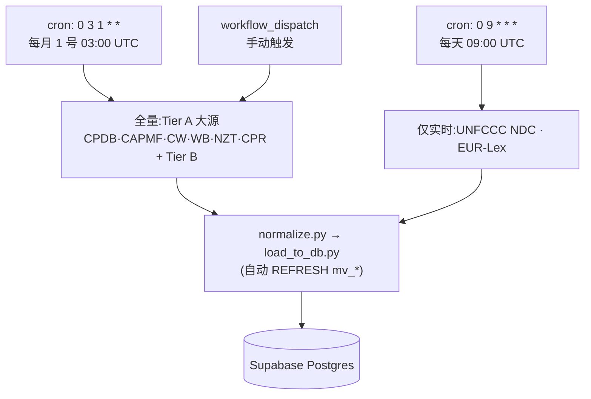
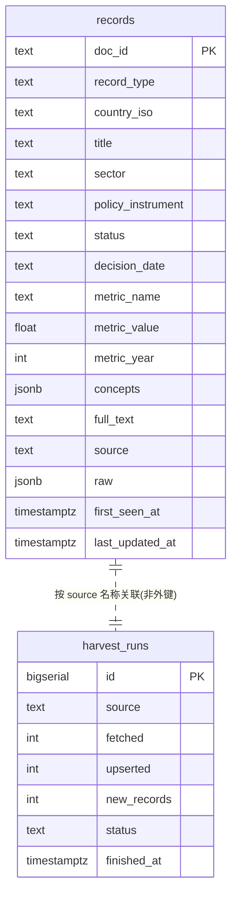

# 全球气候政策监测 · 说明与操作手册（HANDBOOK）

> 本手册是整个项目的「总说明书 + 运维操作手册」。读完它,你应当能独立完成:**采集数据、初始化数据库、本地开发、部署上线、排查故障、添加新数据源**。
>
> 英文版:[`HANDBOOK.en.md`](./HANDBOOK.en.md) · PDF:`HANDBOOK.pdf` / `HANDBOOK.en.pdf`(由 `tools/build-pdf.mjs` 生成)
>
> 配套文档(各有侧重,本手册是入口):
> - [`README.md`](./README.md) — 快速上手
> - [`PLAN.md`](./PLAN.md) — 产品方向与可视化设计
> - [`FUSION.md`](./FUSION.md) — 多源融合(crosswalks + fact 视图)
> - [`SETUP.md`](./SETUP.md) — Supabase / Vercel 手把手开通
> - [`CLAUDE.md`](./CLAUDE.md) — 给 AI 协作者的代码导引
> - [`docs/data_dictionary.csv`](./docs/data_dictionary.csv) — 字段 → 来源映射

---

## 目录

1. [这是什么](#1-这是什么)
2. [总体架构与数据流](#2-总体架构与数据流)
3. [仓库目录结构](#3-仓库目录结构)
4. [技术栈与需要开通的服务](#4-技术栈与需要开通的服务)
5. [环境变量大全](#5-环境变量大全)
6. [数据来源详解](#6-数据来源详解)
7. [如何采集数据(管线 + 命令)](#7-如何采集数据管线--命令)
8. [数据库:初始化与结构](#8-数据库初始化与结构)
9. [Web 应用 与 API 一览](#9-web-应用-与-api-一览)
10. [部署上线](#10-部署上线)
11. [日常运维](#11-日常运维)
12. [故障排查(碰到问题怎么办)](#12-故障排查碰到问题怎么办)
13. [安全与权属](#13-安全与权属)
14. [命令速查表](#14-命令速查表)

---

## 1. 这是什么

**全球气候政策监测(Climate Policy Monitor)** 是一个把全球气候相关的**法律、政策、NDC、净零承诺、碳定价**等数据,从 **8 个权威来源**统一采集、归一化、入库,并以**可视化 + 全文检索 + 交叉分析**呈现的平台。约 **67 万条记录**。

它是「**气候与科学传播研究计划 (Program on Climate and Science Communication)**」**监测家族**的第三个成员:
- 新闻监测 `monitor.newsfindsme.com`
- 论文监测 `pmonitor.newsfindsme.com`
- **政策监测 `cpmonitor.newsfindsme.com`(本项目)**
- 研究门户 `research.newsfindsme.com`

线上地址:**https://cpmonitor.newsfindsme.com**(Vercel 部署,`…vercel.app` 为同一部署的备用域名)。

---

## 2. 总体架构与数据流

三层,共享一张 Postgres 表:



- **采集**只写 Postgres;中间 CSV 都是可重生的临时产物(已 gitignore,不入库不提交)。
- **Web 只读 Postgres**,从不读 CSV。
- **GitHub Actions** 按 cron 定时跑采集管线(见 §7)。

**关键设计**
- **`doc_id` 是带来源前缀的主键**(`cpdb:123`、`cpr:…`、`ndc:CHN:…`),`load_to_db.py` 用 `ON CONFLICT (doc_id) DO UPDATE` 幂等 upsert,重复采集不会产生脏数据。
- **`raw` JSONB 列保留每条记录的完整原始字段**(高频大源 OECD/ndc_content 为省空间省略 raw)。
- **`record_type` 区分异构记录**:`law | policy | ndc | lts | net_zero | carbon_price | carbon_crediting | cooperative_approach | stringency_score | litigation`。

**请求链路(为何国内慢、缓存如何起作用):**



> 国内访问慢的瓶颈是 **浏览器 → Vercel 边缘** 这一跳(大陆无 PoP + GFW + 代理),**不是**后面的服务器/数据库。详见 §12。

---

## 3. 仓库目录结构

```
climate-policy-platform/
├─ ingest/                  # 采集层 (Python 3.11/3.12)
│  ├─ common.py             # 共享:COLUMNS 列定义、DB 连接、CSV 读取、采集清单
│  ├─ fetch_cpdb.py         # 8 个数据源各一个 fetcher
│  ├─ fetch_oecd_capmf.py
│  ├─ fetch_climatewatch.py
│  ├─ fetch_worldbank_carbon.py
│  ├─ fetch_netzero.py
│  ├─ fetch_unfccc_ndc.py
│  ├─ fetch_eurlex.py
│  ├─ fetch_cpr.py
│  ├─ normalize.py          # 把所有 *_raw.csv 归一化为 records_normalized.csv
│  ├─ load_to_db.py         # upsert 入库 + 写 harvest_runs + 刷新物化视图
│  ├─ run_all.ps1           # 一键本地全量:fetch→normalize→load
│  ├─ requirements.txt
│  └─ .env.example          # 复制成 .env 填 DATABASE_URL(.env 不入库)
├─ db/
│  ├─ schema.sql            # records / harvest_runs / 基础视图 / 索引(必跑)
│  ├─ perf.sql              # 看板物化视图 + idx_rec_updated(必跑)
│  ├─ fusion.sql            # crosswalks + fact 融合视图(进阶分析用,建议跑)
│  └─ crosswalks/*.csv      # 口径映射(sector/instrument/status/legal_force)
├─ web/                     # Next.js 14 App Router (Vercel)
│  ├─ app/                  # 页面 + app/api/* 路由
│  ├─ components/           # 图表、地图、表格、Shell 等
│  ├─ lib/                  # db.js / i18n.js / iso.js / cache.js / csv.js / crossdb.js
│  ├─ public/               # countries-110m.json(世界地图,本地打包,不走 CDN)
│  └─ package.json
├─ docs/data_dictionary.csv # 字段 → 来源映射
├─ tools/build-pdf.mjs      # 生成 HANDBOOK.pdf / HANDBOOK.en.pdf(Chrome headless)
├─ .github/workflows/ingest.yml  # 定时采集 CI
├─ HANDBOOK.md (本文) / HANDBOOK.en.md / README.md / PLAN.md / FUSION.md / SETUP.md / CLAUDE.md
└─ .gitignore               # 忽略 .env / node_modules / data 中间产物
```

> ⚠️ **git 根目录是上一级 `Downloads/`,不是本文件夹。** `git status` 会刷出大量无关文件。`git add` 一定要**显式指定路径**,**绝不要** `git add -A` / `git add .`。

---

## 4. 技术栈与需要开通的服务

| 层 | 技术 | 说明 |
|---|---|---|
| 采集 | Python **3.11 / 3.12** | 3.14 上 pandas/psycopg2/pyarrow 可能没轮子,**别用 3.14** |
| 数据库 | **Supabase** Postgres(免费层) | 2GB 盘,当前用约 0.5GB |
| Web | **Next.js 14** + React 18 + Recharts + react-simple-maps | App Router |
| DB 驱动(web) | **postgres.js**(`postgres` 包) | 不是 `@vercel/postgres`(那个只连 Neon,连不上 Supabase) |
| 托管 | **Vercel** | 自动从 GitHub `main` 分支部署 |
| 定时采集 | **GitHub Actions** | cron;在国内本机直连 Postgres 常被代理拦,故用 Actions 入库 |

**你需要的账号:** GitHub(仓库 + Actions) · Supabase(数据库) · Vercel(托管)。开通细节见 [`SETUP.md`](./SETUP.md)。

---

## 5. 环境变量大全

| 变量 | 用在哪 | 设在哪 | 用途 / 取值 |
|---|---|---|---|
| `DATABASE_URL` | 采集 (`load_to_db.py`, `common.py`) | GitHub Actions Secret + 本地 `ingest/.env` | Supabase **Session Pooler**:`postgres://postgres.<ref>:<pwd>@aws-0-<region>.pooler.supabase.com:**5432**/postgres` |
| `POSTGRES_URL` | Web (`web/lib/db.js`) | Vercel 环境变量 | Supabase **Transaction Pooler**(端口 **6543**);postgres.js 用 `prepare:false` |
| `PAPERS_DATABASE_URL` | Web 交叉监测 (`crossdb.js`) | Vercel(可选) | 论文库连接串;不设则交叉页论文线缺失 |
| `NEWS_DATABASE_URL` | Web 交叉监测 (`crossdb.js`) | Vercel(可选) | 新闻库连接串;不设则交叉页新闻线缺失 |
| `WB_CARBON_URL` | 采集(世界银行) | Actions Secret(可选) | 覆盖世界银行碳定价 .xlsx 直链;不设则自动从官网解析 |
| `CPDB_URL` | 采集(CPDB,可选) | 本地/Actions | 覆盖 CPDB CSV 直链 |
| `CAPMF_START` / `CAPMF_END` | 采集(OECD,可选) | 本地/Actions | CAPMF 年份范围,默认 1990–2023 |
| `CW_DATASETS` / `CW_MAX_PAGES` | 采集(Climate Watch,可选) | 本地/Actions | 数据集列表 / 翻页上限 |
| `CPR_MAX_DOCS` / `CPR_MAX_SHARDS` / `CPR_SHARD_START` | 采集(CPR,可选) | 本地/Actions | 限量;默认全量 |
| `NETZERO_URL` / `NDCS_URL` | 采集(可选) | 本地/Actions | 覆盖默认镜像直链 |
| `EURLEX_SINCE` / `EURLEX_PAGE` / `EURLEX_MAX` | 采集(EUR-Lex,可选) | 本地/Actions | 起始日期 / 翻页 / 上限 |

> **两个不同的 DB 变量名**:采集用 `DATABASE_URL`,Web 用 `POSTGRES_URL`。**别混。**
> **连接串用 Pooler,不要用 Direct**(`db.<ref>.supabase.co` 是 IPv6-only,免费层在 IPv4/代理网络下连不上)。Session Pooler(5432)给采集,Transaction Pooler(6543)给 Web。
> Vercel 里 `POSTGRES_URL` 记得**对 Build 阶段也勾上可用**,否则 ISR 页构建时连不上库(见 §12 构建超时)。

---

## 6. 数据来源详解

每个源贡献统一 `records` 行的不同部分。以下为**实际代码中的默认地址、环境变量、输出文件、record_type**。

| # | 源 (机构) | 提供什么 | 默认地址 | 输出 CSV | record_type | 许可 |
|---|---|---|---|---|---|---|
| 1 | **CPDB**(NewClimate,经 Zenodo 快照) | 结构化政策:部门/工具/状态/决策年 + stringency | `zenodo.org/records/15432946/files/ClimatePolicyDatabase_v2024.csv` | `cpdb_raw.csv` | `policy` | CC-BY-4.0 |
| 2 | **OECD CAPMF** | 政策强度评分 0–10 + 政策计数,约 50 国,4 级政策领域 | SDMX REST `sdmx.oecd.org/public/rest/data/OECD.ENV.EPI,DSD_CAPMF@DF_CAPMF,1.0/...` | `oecd_capmf_raw.csv` | `stringency_score` | OECD |
| 3 | **Climate Watch**(WRI) | NDC / 长期战略 / 净零内容(按国家键值) | `climatewatchdata.org/api/v1/data` | `climatewatch_raw.csv` | `ndc`/`lts`/`net_zero` | CC-BY-4.0 |
| 4 | **World Bank** 碳定价仪表盘 | 碳价现行价 + 碳信用机制 + 合作方法(3 张表) | 从 `carbonpricingdashboard.worldbank.org/about` 解析 .xlsx | `worldbank_carbon_raw.csv` | `carbon_price`/`carbon_crediting`/`cooperative_approach` | CC-BY-4.0 |
| 5 | **Net Zero Tracker**(经 OWID 镜像) | 净零目标年 + 法律效力 | `ourworldindata.org/grapher/net-zero-targets.csv` | `netzero_raw.csv` | `net_zero` | CC-BY |
| 6 | **UNFCCC NDC Registry**(经 openclimatedata 镜像) | 国家自主贡献登记 | `raw.githubusercontent.com/openclimatedata/ndcs/main/data/ndcs.csv` | `unfccc_ndcs_raw.csv` | `ndc` | 公有领域 |
| 7 | **EUR-Lex**(CELLAR SPARQL) | 欧盟气候相关法规(EuroVoc 概念 5482) | `publications.europa.eu/webapi/rdf/sparql` | `eurlex_raw.csv` | `law`(国家=`EUU`) | EU reuse |
| 8 | **CPR / CCLW**(Climate Policy Radar,经 HuggingFace) | 法律/政策目录元数据 + 知识图谱概念(**仅目录,不含全文**) | HF 数据集 `ClimatePolicyRadar/all-document-text-data`(48 分片) | `cpr_raw.csv` | `law`/`policy`/`litigation` | CC-BY-4.0 |

**重要口径**(也写在了网站的「说明」页):
- **CAPMF 强度是「国家级平均」,不是逐条政策分数** —— `normalize.py` 把 `OBS_VALUE` 按国家平均后映射到该国所有行,同一国所有政策显示同一均值。
- **CPR 只收目录元数据,不含全文**(保留来源链接以便回溯)。
- **全文检索用 Postgres `simple` 配置(不做词干还原)**,以兼容中英混合。
- 每个 fetcher **允许失败/跳过**(CI 里 `|| echo skipped`),缺某源不阻断整条管线。

---

## 7. 如何采集数据(管线 + 命令)

### 7.1 管线顺序(务必按序)
```
fetch_*.py  →  data/*_raw.csv
normalize.py →  data/records_normalized.csv   (消费所有 *_raw.csv)
load_to_db.py → Postgres                       (消费 records_normalized.csv)
```
脚本用 `__file__` 解析路径,**从任意目录都能跑**;务必 `python ingest/<script>.py`(让 `import common` 生效)。

### 7.2 本地一键全量(Windows PowerShell)
```powershell
# 1) 装依赖(用 3.11/3.12 的解释器)
pip install -r ingest/requirements.txt
pip install datasets        # CPR 流式读取需要(可选)

# 2) 配置连接串:复制并填入 Session Pooler 串
copy ingest\.env.example ingest\.env
#   编辑 ingest\.env:DATABASE_URL=postgres://postgres.<ref>:<pwd>@aws-0-<region>.pooler.supabase.com:5432/postgres

# 3) 一键全量(fetch 全部 → normalize → load)
powershell -ExecutionPolicy Bypass -File .\ingest\run_all.ps1
```

### 7.3 单独跑某一步
```powershell
python ingest/fetch_cpdb.py          # 只重采 CPDB → data/cpdb_raw.csv
python ingest/fetch_oecd_capmf.py
python ingest/normalize.py           # 合并所有 *_raw.csv
python ingest/load_to_db.py          # 入库(需 DATABASE_URL)
```

> 🇨🇳 **国内本机直连 Supabase 常失败**(Clash/V2Ray 的 fake-ip 198.18.x.x 会拦原始 Postgres TCP)。
> 对策:**采集靠 GitHub Actions 入库**(见下),本机只用来跑 fetch/normalize 调试、或开个干净网络再 load。

### 7.4 自动采集(GitHub Actions,推荐)
配置文件:[`.github/workflows/ingest.yml`](./.github/workflows/ingest.yml)



- **触发**:
  - `cron: '0 3 1 * *'` —— **每月 1 号 03:00 UTC**,跑**全量**(Tier A 大源 + Tier B)。
  - `cron: '0 9 * * *'` —— **每天 09:00 UTC**,只跑**实时源**(UNFCCC NDC、EUR-Lex)。
  - `workflow_dispatch` —— 在 GitHub 网页 **Actions → Run workflow** 手动触发**全量**。
- **需要的 Secrets**(GitHub → Settings → Secrets and variables → Actions):
  - `DATABASE_URL`(**必填**,Session Pooler 串)
  - `WB_CARBON_URL`(可选)
- **手动触发步骤**:仓库 → Actions → "Ingest Climate Policy Data" → Run workflow → 选 `main` → Run。
- 每个 fetch 步骤允许失败(`|| echo skipped`);`normalize` 和 `load` 不允许失败。

> 采集**不会**把 CSV 提交回仓库(归一化后含 raw JSON 体积大)。Postgres 是唯一权威存储,`harvest_runs` 表是审计轨迹(网站「数据」页可见每个源最近一次采集量)。

---

## 8. 数据库:初始化与结构

### 8.1 首次初始化(在 Supabase SQL Editor 里按序执行)
1. **`db/schema.sql`** —— 建 `records`、`harvest_runs`、基础视图、索引、全文索引。**必跑。**
2. **`db/perf.sql`** —— 建看板物化视图(`mv_kpis` / `mv_map_metrics` / `mv_adoption`)+ `idx_rec_updated`。**必跑**(否则看板慢/空)。
3. **`db/fusion.sql`** —— crosswalks 口径表 + `fact_*` / `v_*` 融合视图,供扩散、LEV2、广度×深度等分析使用。**建议跑**(详见 [`FUSION.md`](./FUSION.md))。
   - 其中 `db/crosswalks/*.csv`(sector/instrument/status/legal_force)是口径映射,按 `FUSION.md` 导入。

> 这些脚本**可安全重复执行**(`IF NOT EXISTS` / `CREATE OR REPLACE` / `DROP ... IF EXISTS`)。

### 8.2 核心表结构



主键 `doc_id`;`record_type` 区分类型;`country_iso`(ISO-3)是融合键;`metric_name`/`metric_value`/`metric_year` 是通用指标槽;`raw` JSONB 存完整原始行;`first_seen_at`/`last_updated_at` 由 DB 维护(insert 默认、conflict 时刷新)。

> **四处列定义必须同步**(改一处常要改全部):`db/schema.sql` / `ingest/common.py` 的 `COLUMNS` / `ingest/load_to_db.py` 的 `INSERT_COLS` / `docs/data_dictionary.csv`。`web/lib/db.js` 只 SELECT 子集——改列名时同步它的查询。

### 8.3 视图
- **基础视图**(schema.sql):`agg_country_record`、`agg_adoption_by_year`、`agg_latest_metric`。
- **物化视图**(perf.sql,看板用,采集后由 `load_to_db.py` 自动 `REFRESH`):`mv_kpis`、`mv_map_metrics`、`mv_adoption`。
- **融合视图**(fusion.sql):`fact_policy`、`fact_metric`、`fact_commitment`、`v_records_canon`、`v_diffusion_curve` 等。

---

## 9. Web 应用 与 API 一览

### 9.1 关键库文件(`web/lib/`)
- **`db.js`** —— postgres.js 客户端 + 所有查询函数;读物化视图(快)。含 `withTimeout()`(给 ISR 构建期查询兜底,见 §12)。
- **`crossdb.js`** —— 懒连接论文/新闻库(`PAPERS_DATABASE_URL` / `NEWS_DATABASE_URL`),供交叉监测。
- **`i18n.js`** —— 中英文字典 + `useT()`;`localStorage` 记住语言。
- **`iso.js`** —— `NUM2ISO`(地图数字码→ISO3)、`cname()`(ISO3→中/英国名)、`ALL`(下拉用)。**没有它地图全是空的**(世界地图按数字码标识,数据是 ISO-3,要靠它对上)。
- **`cache.js`** —— 边缘缓存头 `CACHE`(s-maxage=1800 + SWR)/`CACHE_SHORT`。
- **`csv.js`** —— 图表聚合数据导出 CSV(带 UTF-8 BOM)。

### 9.2 API 路由(`web/app/api/*`,均只读、带边缘缓存)
| 路由 | 用途 | 参数 |
|---|---|---|
| `/api/dashboard` | 看板合并负载(KPI+地图+趋势+新动态),缓存 30 分钟 | — |
| `/api/stats` | KPI + 累计采纳(精简) | — |
| `/api/map` | 各国某指标(choropleth),读 `mv_map_metrics` | `metric=coverage\|stringency\|price\|netzero` |
| `/api/records` | 过滤后的政策列表 | `country/sector/status/recordType/limit` |
| `/api/whatsnew` | 最新入库记录(按 `first_seen_at`) | `limit` |
| `/api/harvest` | 各源最近一次采集(透明度) | — |
| `/api/trends` | 累计采纳 + 强度趋势(按年) | — |
| `/api/composition` | 部门/工具/类型/状态 构成 | — |
| `/api/compare` | 多国对比(部门热力图 + 强度 + 净零) | `c=DEU,CHN,USA` |
| `/api/country` | 单国画像(KPI、强度轨迹、记录) | `iso=CHN` |
| `/api/diffusion` | 各工具累计采纳国数(S 曲线) | — |
| `/api/lev2` | CAPMF LEV2 政策领域强度热力图 | `c=DEU,CHN,…` |
| `/api/analysis` | 广度×深度 + 净零 + 承诺×行动 + 双变量(合并) | — |
| `/api/cross` | 政策 × 论文 × 新闻(按年,跨监测) | — |
| `/api/instrument-mix` | 各国政策工具族占比 | `c=DEU,CHN,…` |
| `/api/search` | 全文检索 + 分面筛选 | `q` + `country/type/source` |
| `/api/search-facets` | 检索下拉用的类型/来源清单(缓存) | — |

### 9.3 页面(`web/app/*`)
看板 `/`(ISR) · 地图 `/map` · 趋势 `/trends`(ISR) · 对比 `/compare` · 构成 `/composition`(ISR) · 分析 `/analysis` · 交叉 `/cross` · 实时 `/live` · 检索 `/search` · 洞察 `/insights` · 说明 `/methodology` · 关于 `/about` · 数据 `/data` · 国家详情 `/country/[iso]`。

### 9.4 本地开发
```powershell
cd web
npm install
# 本地需要 POSTGRES_URL(Transaction Pooler 6543);可临时用 Session Pooler 5432
$env:POSTGRES_URL="postgres://postgres.<ref>:<pwd>@aws-0-<region>.pooler.supabase.com:6543/postgres"
npm run dev      # http://localhost:3000
npm run build    # 生产构建(Vercel 也是这条)
```
> 本仓库**没有测试、没有 linter**,别造 `npm test` / `pytest`。

---

## 10. 部署上线

- **Vercel** 自动从 GitHub `main` 分支部署(`web/` 为根,`vercel.json` 指定 `next build`)。
- **环境变量**(Vercel → Settings → Environment Variables):`POSTGRES_URL`(必填)、`PAPERS_DATABASE_URL`/`NEWS_DATABASE_URL`(可选)。**确保对 Build + Production 都可用**。
- **自定义域名**:`cpmonitor.newsfindsme.com` 已 CNAME 到 Vercel。建议在 Vercel 把它设为 **Primary Domain**,让 `…vercel.app` **301 重定向**过去。
- **发布流程**:本地 `git push`(到 `main`)→ Vercel 自动构建部署。**只 `git add` 明确路径**(见 §3 警告)。
- 提交后看 Vercel 构建日志,正常结束于 `✓ Generating static pages (N/N)`。

---

## 11. 日常运维

- **更新频率**:批量源每月 1 号自动全量;实时源(UNFCCC/EUR-Lex)每天;Web 看板/趋势/构成为 ISR,服务端每 30 分钟再生。需要立刻刷新就去 Actions 手动 Run。
- **手动补一次数据**:GitHub → Actions → Run workflow(全量),跑完 `load_to_db.py` 会自动刷新物化视图。
- **加一个新数据源**(步骤):
  1. 写 `ingest/fetch_newsrc.py`(参考现有 fetcher,用 `common.record_fetch()` 记采集量,输出 `data/newsrc_raw.csv`)。
  2. 在 `ingest/normalize.py` 加一个 `from_newsrc()` mapper,产出统一 `record(...)`,并加进 `SOURCES` 列表;`doc_id` 用 `newsrc:<id>` 前缀。
  3. 在 `.github/workflows/ingest.yml` 加一步 `python ingest/fetch_newsrc.py || echo skipped`。
  4. 若引入新列:同步 §8.2 的「四处列定义」。
- **改口径分类(sector/instrument 等)**:改 `db/crosswalks/*.csv` 并重跑 `db/fusion.sql`(见 `FUSION.md`)。
- **改了列名**:同步 schema.sql / common.COLUMNS / load_to_db.INSERT_COLS / data_dictionary.csv,以及 `web/lib/db.js` 里用到该列的查询。

---

## 12. 故障排查(碰到问题怎么办)

> 按「症状 → 原因 → 解决」速查。多数是网络/连接串/物化视图三类。

**▶ Vercel 构建超时失败:`Static page generation for / is still timing out`**
- 原因:看板/趋势/构成是 ISR,**构建期就会查 Supabase**;若 Build 阶段连不上库,查询挂死超过 60s。
- 解决:已用 `web/lib/db.js` 的 `withTimeout(…, 12s)` 兜底(超时回退空数据,运行时再由 ISR/客户端自愈补上)。**另外确保 Vercel 的 `POSTGRES_URL` 对 Build 阶段可用**,这样构建期就能烤进真实数据。

**▶ 国内打开很慢 / 偶尔打不开**
- 原因:**Vercel 在中国大陆无边缘节点**,请求要穿 GFW + 本地代理(fake-ip)绕到香港/东京。实测 8KB 页面 TTFB 也要 1.5–5s、约一半请求失败——**是网络,不是应用**(应用侧已做全站边缘缓存、代码分包、关键页 ISR、看板数据仅 10KB)。
- 解决:① 换香港/日本节点或直连验证;② 治本:迁到**香港/新加坡 VPS** 或 **国内 CDN + ICP 备案**(参考新闻/论文监测的托管)。换域名(`cpmonitor…`)**不会变快**——它只是 CNAME 到同一个 Vercel。

**▶ 本机 `load_to_db.py` 连接失败**(`connection to server … 198.18.x.x failed` / `server closed the connection`)
- 原因:Clash/V2Ray fake-ip 拦了原始 Postgres TCP。
- 解决:改用 **GitHub Actions** 入库;或换干净网络;务必用 **Session Pooler(5432)**,别用 Direct(IPv6-only)。

**▶ Web 页面没数据但 `/api/stats` 有数据**
- 原因:历史上是世界地图 topojson 从 CDN(被墙)加载失败 → 已**本地打包** `web/public/countries-110m.json`。
- 或:地图用**数字国家码**、数据是 **ISO-3**,对不上 → 已用 `web/lib/iso.js` 的 `NUM2ISO` 修复。

**▶ 看板很慢**
- 原因:早期每次请求都全表聚合 67 万行;或物化视图没建。
- 解决:跑 `db/perf.sql` 建物化视图;`/api/*` 已全部加边缘缓存(`web/lib/cache.js`);看板/趋势/构成走 ISR。

**▶ `psycopg2.errors.CardinalityViolation: ON CONFLICT … cannot affect row a second time`**
- 原因:同一批次里有重复 `doc_id`(UNFCCC 多语言、世界银行命名碰撞)。
- 解决:`load_to_db.py` 已按 `doc_id` 字典去重;UNFCCC 的 `doc_id` 含 Language;世界银行 Cooperative 含 Year。新写 fetcher 时保证 `doc_id` 唯一。

**▶ CPDB `Error tokenizing data … Expected 1 fields`**
- 原因:官网导出地址返回 Drupal 反爬 HTML,不是 CSV。
- 解决:已改用 **Zenodo 快照 CSV**(`fetch_cpdb.py` 默认地址)。

**▶ OECD CAPMF 抓取失败 / 限流**
- 原因:SDMX API 约 **20 次下载/小时/IP**。
- 解决:别频繁重跑;用宽切片一次取全;失败会跳过(`|| echo skipped`)不阻断管线。

**▶ 打印中文报 `GBK` 编码错(本机控制台)**
- 解决:脚本里 `sys.stdout.reconfigure(encoding='utf-8', errors='replace')`,或 PowerShell `chcp 65001`。

**▶ pip 装 pandas/psycopg2/pyarrow 失败**
- 原因:用了 **Python 3.14**(没轮子)。
- 解决:换 **3.11 / 3.12**。

**▶ 交叉页论文/新闻线缺失**
- 原因:Vercel 未设 `PAPERS_DATABASE_URL` / `NEWS_DATABASE_URL`。
- 解决:在 Vercel 配上这两个连接串。

**▶ `@vercel/postgres` 报 `invalid_connection_string`**
- 原因:`@vercel/postgres` 只连 Neon,连不上 Supabase。
- 解决:已迁到 **postgres.js**(`prepare:false, ssl:'require'`)。

---

## 13. 安全与权属

- **`.env` / `node_modules` / `data/*` 已被 `.gitignore` 忽略,均未提交**(已核实 `ingest/.env` 不在 git 跟踪中)。仓库为**公开**,所以**绝不要把任何密钥/连接串写进代码或提交**——连接串只放 GitHub Secrets 与 Vercel 环境变量。
- 若不慎泄露过 `DATABASE_URL`:去 Supabase **重置数据库密码**并更新 Secrets/环境变量。
- **数据权属**:各原始数据集著作权归各提供方(见 §6 许可列与网站「关于/说明」页)。本平台代码、设计与衍生可视化属「气候与科学传播研究计划」。衍生聚合视图/图表可在注明出处下用于**非商业研究与教学**。
- **免责**:仅供研究与教育用途;数据自动采集归一化,可能有延迟/缺失/映射误差,按「现状」提供,不构成法律/投资/政策建议,以官方原始来源为准。

---

## 14. 命令速查表

```powershell
# —— 采集(本地) ——
pip install -r ingest/requirements.txt; pip install datasets
copy ingest\.env.example ingest\.env          # 填 DATABASE_URL(Session Pooler 5432)
powershell -ExecutionPolicy Bypass -File .\ingest\run_all.ps1   # 全量 fetch→normalize→load
python ingest/normalize.py                     # 只重新归一化
python ingest/load_to_db.py                    # 只重新入库

# —— 数据库(Supabase SQL Editor 按序) ——
#   db/schema.sql  →  db/perf.sql  →  db/fusion.sql
CREATE INDEX IF NOT EXISTS idx_rec_updated ON records (last_updated_at DESC NULLS LAST);  # perf.sql 内含

# —— Web ——
cd web; npm install
$env:POSTGRES_URL="…6543/postgres"; npm run dev   # 本地开发
npm run build                                       # 生产构建(同 Vercel)

# —— 发布 ——
git add web ingest db docs HANDBOOK.md HANDBOOK.en.md tools .github   # 显式路径!别 git add -A
git commit -m "…"; git push                          # 推 main → Vercel 自动部署

# —— 生成 PDF(需 Node;用本机 Chrome/Edge 无头打印) ——
node tools/build-pdf.mjs                              # 产出 HANDBOOK.pdf / HANDBOOK.en.pdf

# —— 自动采集 ——
# GitHub → Actions → "Ingest Climate Policy Data" → Run workflow(手动全量)
```

---

*最后更新:2026-06。本手册随代码演进,改动管线/源/部署时请同步更新本文件。*
